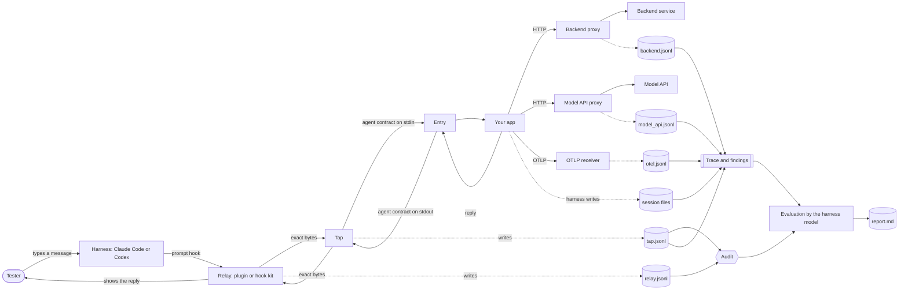

# Architecture

This page shows the parts of verbatim-relay and how the data goes between them. [SPEC.md](../SPEC.md) defines each part exactly. This page tells you why each part exists and where to read more.

## The problem

A tester talks to a chat agent through a coding harness: Claude Code or Codex. If the harness model carries the messages, it also writes them. Then it judges its own text. verbatim-relay takes the model out of the conversation, and keeps 2 records that a third program can compare.

## Data flow

The solid lines carry the conversation. The dotted lines write a record. The relay, the tap and the proxies run on the tester's machine, on `127.0.0.1`.

## The relays

A relay is the harness extension that carries each message and each reply. There are 2 relays ([SPEC.md section 5](../SPEC.md#5-relays)):

- **The Claude Code plugin.** It uses function hooks, which are early access. It shows each reply as a row in the chat that the model does not receive. Read [how-to/claude-code.md](how-to/claude-code.md).
- **The hook kit.** It uses the classic hooks that Codex and Claude Code share. It cannot show text in the chat, so `verbatim-relay view` shows each reply in a second terminal. Read [how-to/codex.md](how-to/codex.md).

In relay mode, the relay takes each prompt before the model sees it. It sends the prompt to the tap and blocks it from the model. The relay also denies a model tool call that names the address of the tap or the agent. It also denies a call that changes the files of a test. The deny is best effort. [limits.md](limits.md) tells you what it does not stop.

A relay fails closed. If it cannot send a message, the message still does not go to the model. The relay shows the error and records it as a relay error ([SPEC.md section 5](../SPEC.md#5-relays)).

## The tap

The tap is a proxy between the relay and the agent. It forwards each request and each response with no change, and it writes the tap record. It has 2 modes ([SPEC.md section 4](../SPEC.md#4-tap)):

- **Stdio mode.** The tap starts the entry and speaks the agent contract with it. A test uses this mode.
- **HTTP mode.** The tap is in front of an agent that is already an HTTP server. Read [how-to/http-tap.md](how-to/http-tap.md).

## The entry and the agent contract

The entry is a thin wrapper that starts your app and speaks the agent contract on stdin and stdout. The contract is one JSON line in for each message, and one JSON line out for each reply ([SPEC.md section 6](../SPEC.md#6-agent-contract-version-1)). The entry is test code, not app code. It is in `.verbatim-relay/`, and your app's code does not change.

This is the plumbing that a test needs. You write the entry once. You change it when the start or the wiring of your app changes. In Python, `verbatim_relay.agent.serve()` speaks the contract for one function. Read [how-to/connect-your-agent.md](how-to/connect-your-agent.md).

## The bridge

The bridge is a background process that runs one test ([SPEC.md section 7.2](../SPEC.md#72-start-and-end)). `verbatim-relay start` starts it. The bridge then:

1. starts the OTLP receiver, the backend proxies and the model API proxies;
2. starts the entry through the tap in stdio mode;
3. watches for the Claude Code sessions that a process of the entry runs ([SPEC.md section 7.3](../SPEC.md#73-model-sessions)).

`verbatim-relay end` stops it. The bridge then:

1. stops the entry and the proxies;
2. finds the Codex sessions of the app;
3. copies each session file into the test folder;
4. builds the trace, writes `audit.json` and writes the seal.

## The proxies and the receiver

These parts record what the app does to answer a message. Each one is independent of the app's code, except the OTLP receiver.

- **Backend proxies.** One recording proxy for each HTTP service of the app. The bridge gives the app the proxy URL in the service's environment variable ([SPEC.md section 7.6](../SPEC.md#76-backend-proxies)). Read [how-to/add-a-backend.md](how-to/add-a-backend.md).
- **Model API proxies.** One recording proxy for the Anthropic API and one for the OpenAI API, in `ANTHROPIC_BASE_URL` and `OPENAI_BASE_URL` ([SPEC.md section 7.7](../SPEC.md#77-model-api-proxies)).
- **OTLP receiver.** It takes the OpenTelemetry spans and logs of the app ([SPEC.md section 7.5](../SPEC.md#75-otlp-receiver)).

Read [how-to/record-model-calls.md](how-to/record-model-calls.md) for the last two. The proxies remove the values of secret headers and secret query parameters from the record, but forward them with no change.

## The model sessions

If your app runs its own Claude Agent SDK or Codex sessions, the harness binary writes a session file for each one. The test copies these files. They hold each tool call of the app's model, with its arguments and its result. The harness writes them, not your app, so their format can change between harness versions ([SPEC.md section 7.3](../SPEC.md#73-model-sessions)).

## The audit

The audit compares the relay record with the tap record ([SPEC.md section 3](../SPEC.md#3-audit)). It aligns the tester messages with the agent inputs, and then it compares each reply. It compares bytes. It does not normalize whitespace, line ends or Unicode. It reports 7 break classes: `altered_input`, `injected_input`, `duplicate_send`, `out_of_order`, `not_delivered`, `altered_reply` and `unshown_reply`.

The audit fails closed. If a record is missing or invalid, it exits with 2 and reports no result. It never reports clean on a record that it cannot read.

## The seal

At the end of a test, the bridge writes the SHA-256 of each file of the test folder to `seal.json`. It also writes a copy outside the project ([SPEC.md section 7.4](../SPEC.md#74-seal)). `verbatim-relay verify` shows each file that changed after the end. The seal does not stop a change. It makes a change visible.

## The trace and the findings

The trace, `trace.jsonl`, joins the session files, `otel.jsonl`, `backend.jsonl` and `model_api.jsonl` into one record. Each item has its turn and a pointer to its line in the source file ([SPEC.md section 8](../SPEC.md#8-trace)). 12 checks write `findings.json`, for example a tool call that failed or a turn in which no model ran ([SPEC.md section 8.6](../SPEC.md#86-findings)). The findings do not change the exit code of the audit.

## The evaluation

At the prompt `verbatim-relay end`, the relay ends the test and gives the harness model the evaluation prompt ([SPEC.md section 9](../SPEC.md#9-evaluation)). The model did not see the conversation while you talked. It reads the transcript with the trace, the findings and the audit. It reads your app's code and rules, and it checks the app's state with read-only commands. Then it writes `report.md`. After a test, the relay denies model writes to the test folder, except `report.md`.

A report is a model answer, so it can be wrong. [evaluation-example.md](evaluation-example.md) shows one report and what the model got wrong.

## Timeouts

Each wait on the relay path ends before the wait around it, so that the relay can still block the prompt ([SPEC.md section 4.3](../SPEC.md#43-timeouts)). The order is the agent, the tap, the relay and the hook. The test [tests/test_timeouts.py](../tests/test_timeouts.py) checks the order.

## Where to read the code

| Part | Code |
|---|---|
| Hook kit | [src/verbatim_relay/kit.py](../src/verbatim_relay/kit.py) |
| Plugin | [plugins/claude-code/hooks/register.tsx](../plugins/claude-code/hooks/register.tsx), [core.ts](../plugins/claude-code/hooks/core.ts) |
| Tap, HTTP mode | [src/verbatim_relay/tap.py](../src/verbatim_relay/tap.py), [adapters.py](../src/verbatim_relay/adapters.py) |
| Tap, stdio mode | [src/verbatim_relay/stdio.py](../src/verbatim_relay/stdio.py) |
| Agent contract | [src/verbatim_relay/contract.py](../src/verbatim_relay/contract.py), [agent.py](../src/verbatim_relay/agent.py) |
| Bridge | [src/verbatim_relay/bridge.py](../src/verbatim_relay/bridge.py) |
| Proxies and receiver | [backend.py](../src/verbatim_relay/backend.py), [model_api.py](../src/verbatim_relay/model_api.py), [otlp.py](../src/verbatim_relay/otlp.py) |
| Records and audit | [record.py](../src/verbatim_relay/record.py), [audit.py](../src/verbatim_relay/audit.py) |
| Seal | [seal.py](../src/verbatim_relay/seal.py) |
| Trace and evaluation | [trace.py](../src/verbatim_relay/trace.py), [evaluation.py](../src/verbatim_relay/evaluation.py), [evaluate.md](../src/verbatim_relay/evaluate.md) |
| Read check of the deny | [commands.py](../src/verbatim_relay/commands.py) |
