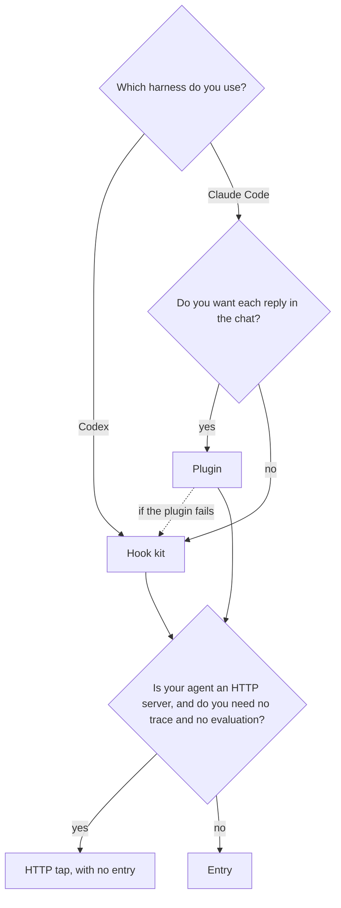

# Choose a relay

A [relay](../reference/glossary.md#relay) carries each message to your agent and each reply back to you. There are [2 relays](../../SPEC.md#5-relays): the Claude Code plugin and the hook kit. Use this page to select one, and to select how the relay reaches your agent.

## Decision flow



1. Select the relay for your [harness](../reference/glossary.md#harness):
   - Codex uses the hook kit. Read [codex.md](codex.md).
   - In Claude Code, use the plugin or the hook kit. The plugin shows each reply in the chat. The hook kit shows each reply as the reason of a blocked prompt, and in a second terminal. Read [claude-code-plugin.md](claude-code-plugin.md) or [claude-code-hook-kit.md](claude-code-hook-kit.md).
2. Select how the relay reaches your agent:
   - If your agent is already an HTTP server, and you need no [trace](../reference/glossary.md#trace) and no [evaluation](../reference/glossary.md#evaluation), you can use the HTTP [tap](../reference/glossary.md#tap). Read [http-tap.md](http-tap.md).
   - Each other agent uses an [entry](../reference/glossary.md#entry). Read [connect-your-agent.md](connect-your-agent.md).

## Compare the relays

| | Plugin | Hook kit |
|---|---|---|
| What it installs, and where | The plugin, with `claude plugin install`. By default, Claude Code installs it in the user scope, for each of your projects. You write `.nookku/config.json`, or the `setup` skill writes it. | `nookku init` writes `.nookku/config.json`, `.nookku/mode` and [2 hooks](../../src/nookku/kit.py), in the project only. The hooks go in `.claude/settings.local.json` (Claude Code) or `.codex/hooks.json` (Codex). |
| The start and end commands | `/nookku start`. The prompt `nookku end` ends the test and starts the evaluation. `/nookku end` ends the test with no evaluation. | The prompt `nookku start`. The prompt `nookku end` ends the test and starts the evaluation. `nookku end` in a shell ends the test with no evaluation. |
| Where the reply shows | In the chat, as a dim row that the model does not receive, and in the Nookku pane. The status line shows when [relay mode](../reference/glossary.md#relay-mode) is on. | In the chat, as the reason of a blocked prompt, and in `nookku view`, in a second terminal. `codex exec` shows no reason, so use the viewer there. |
| How the model reads the transcript | With the read-only `transcript` tool. The tool runs `nookku transcript`. | With the command `nookku transcript`. |
| The harnesses | Claude Code. The proofs ran on Claude Code 2.1.290 ([data](../../proofs/claude-code/results.json)). | Claude Code and Codex. The proofs ran on Claude Code 2.1.295 ([data](../../proofs/hooks-claude-code/results.json)) and codex-cli 0.160.0 ([data](../../proofs/hooks-codex/results.json)). |
| The limits | It uses function hooks, which are early access and can change between releases. CI pins Claude Code 2.1.290 ([ci.yml](../../.github/workflows/ci.yml)). | It shows a reply only as the reason of a blocked prompt. `codex exec` does not show that reason. In the interactive CLI, the start of a long reply can go off the screen ([data](../../proofs/spikes/hook-display.json)). Codex runs its hooks only after you trust them. |

Both relays need the `nookku` command: `uv tool install nookku`. Both give the model the same transcript text ([SPEC.md section 5](../../SPEC.md#5-relays)). Both relays fail closed: if a relay cannot send a message, the message does not go to the model. For both relays, the deny of model tool calls is best effort. [limits.md](../limits.md) gives each limit.

## Switch from one relay to the other

**Warning:** Never use both relays in one project. If both run, each message goes to the agent two times, and the [audit](../reference/glossary.md#audit) reports a `duplicate_send` break ([SPEC.md section 3.3](../../SPEC.md#33-break-classes)).

With an entry, the two relays use the same `.nookku/config.json` and the same [test folders](../reference/glossary.md#test-folder). A switch keeps your entry and your old tests. Codex has only the hook kit, so a switch applies to Claude Code only.

### From the plugin to the hook kit

1. End the running test. Type `/nookku end`.
2. Disable the plugin in this project only. Give `--scope local`. Without it, the command can disable the plugin at the user scope, and then the plugin stops in each project:

   ```bash
   claude plugin disable --scope local nookku@nookku
   ```

3. Install the hook kit. `init` keeps each key of an existing `.nookku/config.json`, also the entry:

   ```bash
   nookku init claude-code
   ```

4. Do the steps of [claude-code-hook-kit.md](claude-code-hook-kit.md) from the viewer step.

### From the hook kit to the plugin

1. End the running test. Run `nookku end` in a shell.
2. Remove the [2 hooks](../../src/nookku/kit.py) of the kit from `.claude/settings.local.json`. Their command contains `nookku hook`. Keep your other hooks.
3. If you disabled the plugin in this project before, enable it again in this project:

   ```bash
   claude plugin enable --scope local nookku@nookku
   ```

4. Do the steps of [claude-code-plugin.md](claude-code-plugin.md). Your `.nookku/config.json` stays.

With no entry, the plugin reads `tap_url` and the other options from its plugin options ([reference/config.md](../reference/config.md#plugin-options)). The hook kit reads them from `.nookku/config.json`. If you changed an option, set it again for the new relay.
